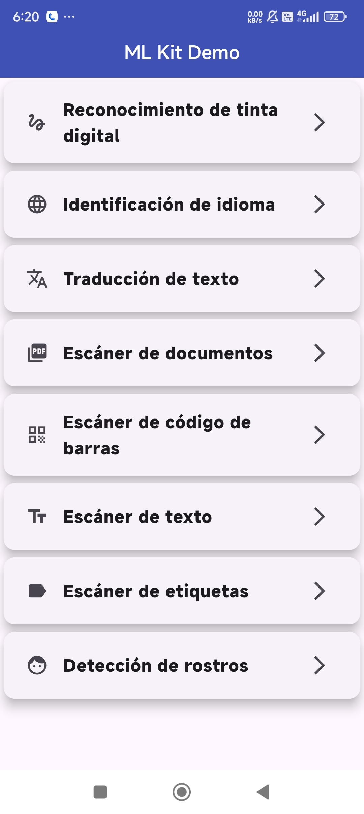

# flutter_ml_kit  
A new Flutter project.




## Getting Started  
This project is a starting point for a Flutter application.

A few resources to get you started if this is your first Flutter project:  
- [Lab: Write your first Flutter app](https://docs.flutter.dev/get-started/codelab)  
- [Cookbook: Useful Flutter samples](https://docs.flutter.dev/cookbook)  

For help getting started with Flutter development, view the [online documentation](https://docs.flutter.dev), which offers tutorials, samples, guidance on mobile development, and a full API reference.

---

## Funcionalidades Principales  
- **Reconocimiento de Tinta Digital:** Convierte manuscritos en texto digital.  
- **Identificación de Idioma:** Detecta automáticamente el idioma de un texto.  
- **Traducción de Texto:** Traduce contenido en tiempo real a múltiples idiomas.  
- **Escáner de Documentos y Texto:** Procesa imágenes para extraer información textual.  
- **Lectura de Códigos de Barras:** Escanea y decodifica diferentes tipos de códigos.  
- **Etiquetado de Imágenes:** Categoriza automáticamente imágenes con etiquetas descriptivas.  
- **Detección de Rostros:** Identifica y analiza rostros en imágenes y videos.  

## Instalación  
1. Clona el repositorio:  
   ```bash
   git clone https://github.com/tu_usuario/flutter_ml_kit.git

2. Navega al directorio del proyecto:
   cd flutter_ml_kit

3. Instala dependencias
    flutter pub get

4. Ejecuta la aplicación en un dispositivo físico o emulador:
    flutter run


